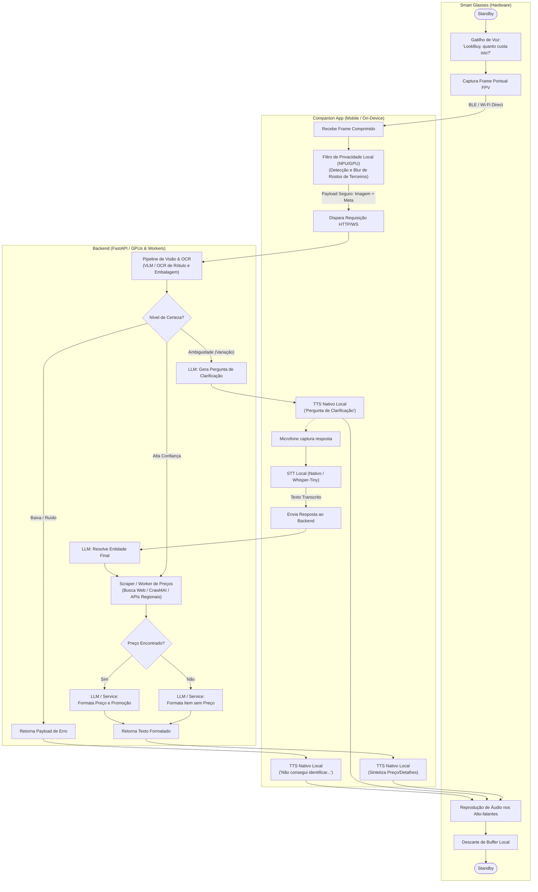
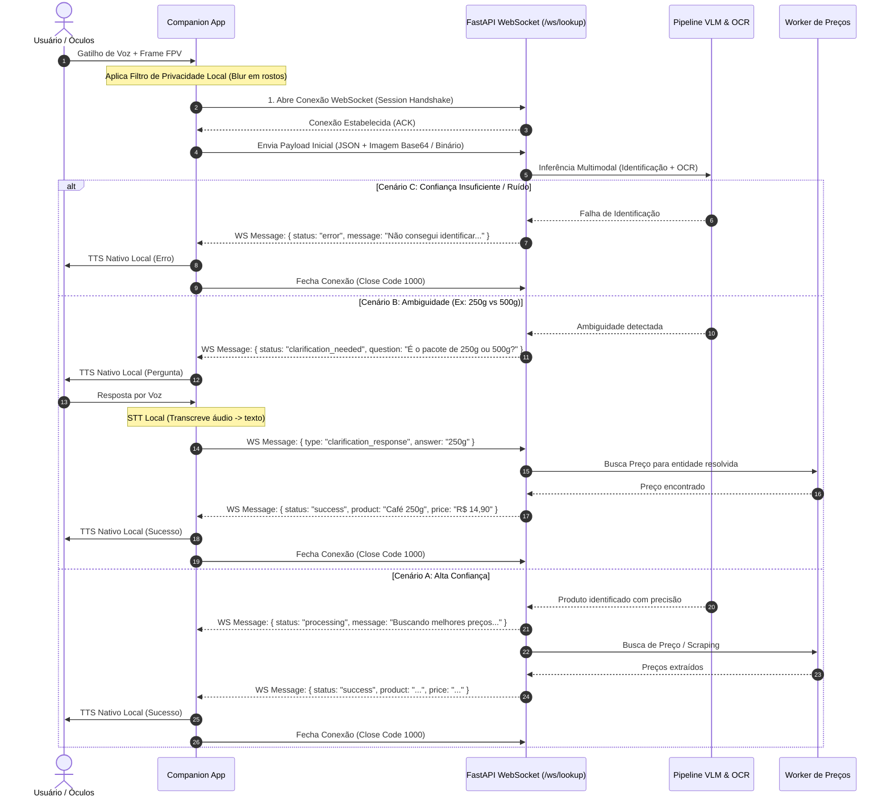

## 1. Visão Geral do Projeto
Breve resumo do que o projeto faz e stack principal (ex: Python/FastAPI, TypeScript/Next.js, etc.).

## 2. Comandos Principais (`uv`)

> **Importante:** Sempre execute comandos de ambiente usando `uv run`. Nunca use `pip` ou `python` soltos.

- **Instalar/Sincronizar Dependências:**
  ```bash
  uv sync
  ```
- **Executar Servidor de Desenvolvimento:**
  ```bash
  uv run uvicorn app.main:app --reload --port 8000
  # ou caso use o CLI do FastAPI:
  # uv run fastapi dev app/main.py
  ```
- **Adicionar Nova Dependência:**
  ```bash
  uv add <nome-do-pacote>
  uv add --dev <nome-do-pacote>  # Dependências de dev
  ```
---

## 3. Arquitetura e Fluxo (Mermaid)

### Diagrama de fluxo


### Diagrama de sequencia

---
## 4. Padrões de Código e FastAPI

- **Tipagem e Schemas:** Use `pydantic.BaseModel` e type hints modernos (`list[str]`, `str | None` em vez de `typing.Optional`/`typing.List`).
- **Injeção de Dependências:** Sempre use `Annotated[..., Depends(...)]` para dependências de rotas.
- **Async/Await:** Mantenha handlers de rota assíncronos (`async def`). Se chamar I/O bloqueante, delegue para threads ou use bibliotecas nativamente assíncronas.
- **Tratamento de Erros:** Lance `HTTPException` com códigos de status semânticos ou use handlers de exceção personalizados.
- **Variáveis de Ambiente:** Use `pydantic-settings` para gerenciar configurações.

---

## 5. Regras para o Agente (Do's & Don'ts)

- **FAÇA:**
  - Sempre verifique se a acao atual esta presente no RoadMap
  - Modo de Execução e Roadmap:
    - Consulte sempre o arquivo `PLAN.md` antes de iniciar uma nova tarefa.
    - Siga as fases estritamente em ordem sequencial.
    - Nunca avance para o próximo passo sem rodar a suíte de testes correspondente com `uv run pytest`.
    - Ao concluir uma sub-tarefa, marque a caixa no `PLAN.md` com `[x]`.
  - Mantenha a separação de responsabilidades (Rotas $\rightarrow$ Services $\rightarrow$ Repositories).

- **NÃO FAÇA:**
  - Não use `pip install` ou manipule `requirements.txt` manualmente (use sempre `uv add`).
  - Não coloque regras de negócio complexas ou consultas diretas ao banco dentro das funções dos endpoints (`routers`).
  - Não desative verificações de tipo com `# type: ignore` sem justificativa clara.