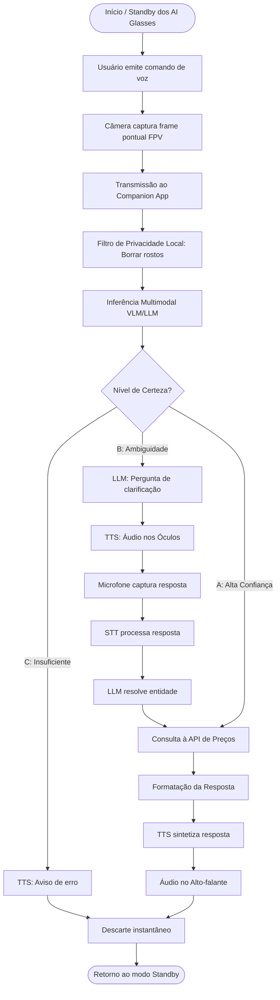

# Arquitetura do Sistema e Guia de Implementação: LookBuy

Este documento serve como o **Plano de Arquitetura e Contexto Base** para o desenvolvimento do **LookBuy**, um verificador e comparador inteligente de preços *mãos-livres* [cite: 2]. O projeto integra-se aos óculos Ray-Ban Meta através do *Meta Wearables Device Access Toolkit (DAT)* [cite: 3].

## 1. Visão Geral (Fluxograma)



## 2. Estratégia de Teste Local (Sem Hardware) - OBRIGATÓRIO
Como o hardware físico não estará disponível na fase online [cite: 3], a aplicação **deve ser totalmente testável no celular desde o Dia 1**. O agente deve implementar o seguinte setup de simulação:

* **Simulação do SDK (Mock Device Kit - MDK):** A classe `DatSessionManager` deve usar o `MockDeviceKit.getInstance(context).enable()` se estiver em modo de debug (`BuildConfig.DEBUG`) [cite: 3].
* **Simulação de Estados:** O código de inicialização do Mock deve obrigatoriamente chamar `pairGlasses(GlassesModel.RAYBAN_META)`, além de forçar os estados `powerOn()` e `don()` (vestir) no dispositivo simulado para que o streaming possa ser iniciado [cite: 3].
* **Simulação de Câmera:** O MDK deve ser configurado para usar a própria câmera traseira do celular (`Front Camera/Back Camera`) ou um arquivo de vídeo `.mp4` convertido para `H.265` (`HEVC`) como feed de entrada [cite: 3].
* **Simulação de Áudio (Crucial):** O DAT SDK **não simula áudio** [cite: 3]. Para testar o pipeline de voz (`SttClient` e `TtsClient`), o desenvolvedor deve usar **fones de ouvido Bluetooth comuns** pareados ao celular que suportem o perfil HFP [cite: 3]. O app não deve distinguir entre o fone comum e os óculos.

## 3. Stack Tecnológica e Dependências
* **Linguagem & UI:** Kotlin, Jetpack Compose.
* **Arquitetura:** Clean Architecture + MVVM, Kotlin Coroutines & Flow (StateFlow/SharedFlow) [cite: 3].
* **Injeção de Dependência:** Hilt ou Koin.
* **Rede:** Retrofit + OkHttp.
* **IA On-Device:** ONNX Runtime Mobile, MediaPipe ou Google ML Kit (para processamento de visão/OCR offline) e vosk-android (para STT offline leve).
* **SDK Meta DAT [cite: 3]:**
  * `mwdat-core:0.8.0` (Registro, Sessão e Dispositivos).
  * `mwdat-camera:0.8.0` (Streaming e Captura de Fotos).
  * `mwdat-mockdevice:0.8.0` (MDK para simular o dispositivo sem hardware).

## 4. Estrutura de Módulos e Pastas (Clean Architecture)

### Módulos Gradle
* `:app` (Apresentação, DI, e configuração inicial)
* `:domain` (Entidades e Regras de Negócio, Kotlin puro)
* `:data` (Repositórios, APIs)
* `:meta_wearables` (Encapsulamento do SDK DAT, MDK e Bluetooth)
* `:ai_engine` (Modelos locais, STT, TTS, Filtros)

### Estrutura de Pacotes (`com.lookbuy.app`)
```text
com.lookbuy.app
├── di/                     # Hilt/Koin Modules
├── domain/                 
│   ├── models/             # ProductCaptureResult, ProductPrice, ConfidenceLevel
│   └── usecases/           # ProcessProductLookUseCase, ResolveAmbiguityUseCase
├── data/                   
│   ├── repository/         # PriceRepositoryImpl
│   └── remote/             # PriceApiService (Retrofit) e DTOs
├── meta_wearables/         
│   ├── session/            # DatSessionManager (Gerencia a sessão e o MockDeviceKit) [cite: 3]
│   ├── camera/             # DatCameraClient (Gerencia streams e captura) [cite: 3]
│   └── audio/              # DatAudioClient (Configura HFP via AudioManager) [cite: 3]
├── ai_engine/              
│   ├── vision/             # PrivacyFilter (Blur), VlmInferenceClient
│   ├── llm/                # DialogueManager
│   └── speech/             # SttClient (AudioRecord), TtsClient (AudioTrack)
└── presentation/           
    ├── screens/            # Jetpack Compose Screens 
    └── viewmodels/         # LookBuyViewModel 
```

## 5. Regras Críticas do Meta DAT SDK (Para o Agente de IA)
O agente desenvolvedor **deve** obedecer estritamente a estas regras de implementação do DAT SDK [cite: 3]:

1. **Autenticação e Gradle:** O DAT SDK fica no GitHub Packages e exige um `Personal Access Token (PAT)` no `local.properties` com permissão `read:packages` [cite: 3].
2. **Inicialização Única:** `Wearables.initialize(context)` deve ser chamado apenas uma vez no `onCreate()` da classe `Application`. Se chamado antes, lançará `NOT_INITIALIZED` [cite: 3].
3. **AndroidManifest (Callback do Meta AI):** É obrigatório declarar um `intent-filter` na Activity com um *URI scheme* próprio (ex: `lookbuy://`) para que o app Meta AI consiga devolver o usuário ao app após o registro. Também deve incluir as tags `<meta-data>` para `APPLICATION_ID` e `CLIENT_TOKEN` (que podem ser `0` durante o Developer Mode) [cite: 3].
4. **Fluxo de Registro:** O app não pode criar a sessão sem antes verificar o registro. Deve chamar `Wearables.startRegistration` e observar o `Wearables.registrationState` (StateFlow) até que atinja o estado `REGISTERED` [cite: 3].
5. **Gerenciamento de Sessão:** A conexão é mantida pela `DeviceSession`. Iniciar/Parar são operações *fire-and-forget*. O app deve observar `session.state` para saber quando passou para `STARTED` antes de adicionar streams de vídeo [cite: 3].
6. **Resolução de Vídeo:** O `StreamConfiguration` deve usar resolução `MEDIUM` (504x896) ou `LOW` a 15 ou 24 FPS. Defina `compressVideo = false` para receber frames YUV ideais para inferência em modelos locais [cite: 3].
7. **Captura Fotográfica e MDK Rotação:** Só chame `capturePhoto()` quando o stream estiver em `STREAMING`. A API retorna `PhotoData.Bitmap` ou `HEIC`. **Atenção:** Quando o MDK está ativo usando a câmera do celular, a imagem retornada vem rotacionada em 90 graus (comportamento nativo documentado). A IA de visão deve rotacionar a imagem de volta [cite: 3].
8. **Áudio:** O DAT SDK **não gerencia áudio** [cite: 3]. O áudio é roteado pelas APIs padrão do Android. Utilize o perfil **HFP (Hands-Free Profile)** chamando `setCommunicationDevice`. Configure o áudio HFP *antes* de iniciar a sessão de streaming de vídeo [cite: 3].
9. **Permissões Exigidas:** `BLUETOOTH_CONNECT`, `RECORD_AUDIO`, `CAMERA` [cite: 3]. (A permissão `CAMERA` do Android é exigida pelo MDK para usar a lente do celular) [cite: 3].

## 6. Plano de Execução (Fases de Desenvolvimento)
Para o Agente de IA, siga esta ordem de implementação:

* **Fase 1: Configuração Base & Mock Device Kit:**
  * Configurar o projeto Gradle, permissões, Intent Filters (URI scheme) e GitHub Packages [cite: 3].
  * Implementar `DatSessionManager` ativando o `MockDeviceKit` no modo debug [cite: 3].
  * Parear o dispositivo mockado, chamar `powerOn()` e `don()`, e expor os estados para a UI [cite: 3].
* **Fase 2: Integração de Áudio e Voz (Via Fone Bluetooth):**
  * Criar `DatAudioClient` que força a comunicação para `TYPE_BLUETOOTH_SCO`.
  * Implementar captura (`AudioRecord`) e reprodução e testar com um fone de ouvido comum pareado ao celular [cite: 3].
* **Fase 3: IA Local e Visão (Câmera do Celular):**
  * Configurar o `DatCameraClient` para iniciar o stream [cite: 3]. Como o mock está ativo, a imagem virá da câmera traseira do celular [cite: 3].
  * Implementar o tratamento de rotação de 90° gerado pelo MDK [cite: 3].
  * Implementar o filtro de privacidade e VLM on-device.
* **Fase 4: Orquestração e UI:**
  * Implementar os UseCases e integrá-los no `LookBuyViewModel`.
  * Criar as telas em Compose observando os estados mockados perfeitamente como se fossem o óculos real.
