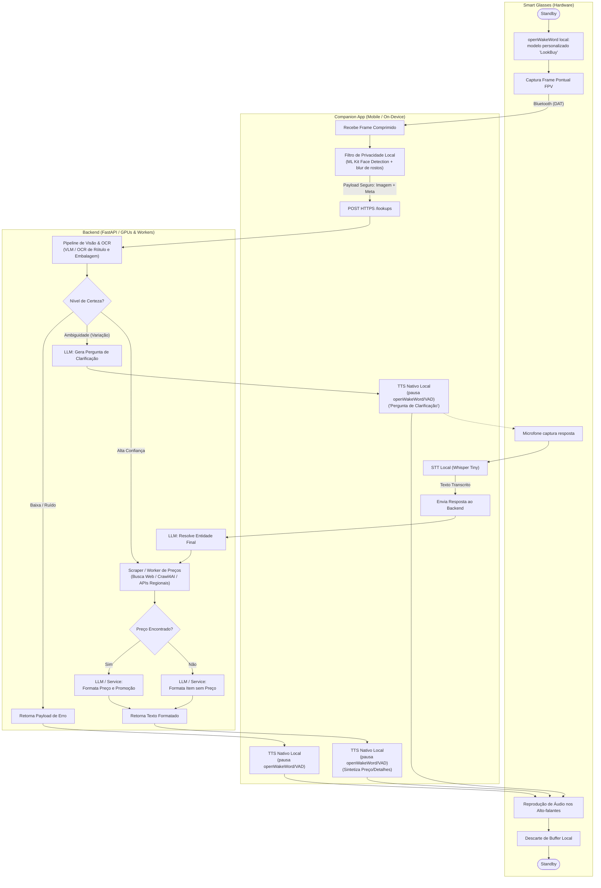

# Arquitetura do Sistema e Guia de Implementação: LookBuy (Client-Server)

Este documento serve como o **Plano de Arquitetura e Contexto Base** para o desenvolvimento do **LookBuy**, um verificador e comparador inteligente de preços *mãos-livres* [cite: 2]. O projeto integra-se aos óculos Ray-Ban Meta através do *Meta Wearables Device Access Toolkit (DAT)* [cite: 3] e utiliza uma arquitetura híbrida (Edge AI + Nuvem) para processamento [cite: 1].

## 1. Visão Geral (Fluxograma)



## 2. Estratégia de Teste Local (Sem Hardware) - OBRIGATÓRIO
Como o hardware físico não estará disponível na fase online [cite: 3], a aplicação mobile **deve ser totalmente testável no celular desde o Dia 1**. O agente deve implementar o seguinte setup:

* **Simulação do SDK (Mock Device Kit - MDK):** A classe `DatSessionManager` deve usar o `MockDeviceKit.getInstance(context).enable()` se estiver em modo de debug (`BuildConfig.DEBUG`) [cite: 3].
* **Simulação de Estados:** O código de inicialização do Mock deve obrigatoriamente chamar `pairGlasses(GlassesModel.RAYBAN_META)`, além de forçar os estados `powerOn()`, `unfold()` e `don()` (vestir) no dispositivo simulado para que o streaming possa ser iniciado [cite: 3].
* **Simulação de Câmera:** O MDK deve ser configurado para usar a própria câmera traseira do celular (`Front Camera/Back Camera`) ou um arquivo de vídeo `.mp4` convertido para `H.265` (`HEVC`) como feed de entrada [cite: 3].
* **Simulação de Áudio (Crucial):** O DAT SDK **não simula áudio** [cite: 3]. Para testar o pipeline de voz (`SttClient` e `TtsClient`), o desenvolvedor deve usar **fones de ouvido Bluetooth comuns** pareados ao celular que suportem o perfil HFP [cite: 3]. O app possuirá um modo *fallback* para usar o microfone/alto-falante nativos do celular caso nenhum dispositivo Bluetooth esteja conectado.

> O MDK substitui a base do dispositivo, não a lógica do app: o mesmo pipeline de registro, sessão e stream deve rodar com o mock na etapa online e com os óculos reais na presencial. Não crie uma implementação paralela "fake" para debug.

## 3. Stack Tecnológica e Dependências
Esta arquitetura atende ao edital combinando processamento na nuvem com processamento local contínuo de recursos restritos [cite: 1].

**Mobile (Android/Companion App):**
* **Linguagem & UI:** Kotlin, Jetpack Compose.
* **Arquitetura:** Clean Architecture + MVVM, Kotlin Coroutines & Flow [cite: 3].
* **Rede:** Retrofit/OkHttp com HTTPS; `POST /lookups` e `POST /lookups/{lookupId}/clarifications`.
* **IA On-Device:** openWakeWord com modelo personalizado “LookBuy”, WebRTC VAD, Whisper Tiny para STT e ML Kit Face Detection para detectar rostos antes do blur.
* **SDK Meta DAT [cite: 3]:** `mwdat-core:0.8.0`, `mwdat-camera:0.8.0`, `mwdat-mockdevice:0.8.0`.

**Backend (Servidor - Escopo Separado):**
* FastAPI (Python), integração com VLM (GPT-4o/Gemini Pro Vision), Web Scraping (Crawl4AI) e LLMs.

### 3.1 Configuração obrigatória do DAT 0.8.0

O SDK é distribuído por GitHub Packages. O token **não deve ser versionado**: adicione `github_token=SEU_PAT_COM_read_packages` ao `local.properties` e mantenha esse arquivo fora do Git. Em `settings.gradle.kts`, leia o token e adicione o repositório:

```kotlin
val localProperties = Properties().apply {
    val path = rootDir.toPath() / "local.properties"
    if (path.exists()) load(path.inputStream())
}

dependencyResolutionManagement {
    repositories {
        google(); mavenCentral()
        maven {
            url = uri("https://maven.pkg.github.com/facebook/meta-wearables-dat-android")
            credentials {
                username = ""
                password = System.getenv("GITHUB_TOKEN")
                    ?: localProperties.getProperty("github_token")
            }
        }
    }
}
```

No catálogo de versões, declare os três artefatos `com.meta.wearable:mwdat-core`, `com.meta.wearable:mwdat-camera` e `com.meta.wearable:mwdat-mockdevice`, todos na versão `0.8.0`; e use `implementation(libs.mwdat.core)`, `implementation(libs.mwdat.camera)` e `implementation(libs.mwdat.mockdevice)` no módulo `app`.

O Manifest deve conter `BLUETOOTH`, `BLUETOOTH_CONNECT`, `INTERNET`, `CAMERA` e, para voz, `RECORD_AUDIO`, além de `uses-feature` de câmera não obrigatório. Use os nomes de metadados reais do DAT e placeholders de Developer Mode:

```xml
<meta-data android:name="com.meta.wearable.mwdat.APPLICATION_ID"
    android:value="${mwdat_application_id}" />
<meta-data android:name="com.meta.wearable.mwdat.CLIENT_TOKEN"
    android:value="${mwdat_client_token}" />
```

Em `defaultConfig`, defina ambos os placeholders como `"0"` durante o Developer Mode. A `MainActivity` também deve expor um `intent-filter` `VIEW`/`BROWSABLE` com o scheme `lookbuy` para o retorno do app Meta AI.

## 4. Estrutura de Módulos e Pastas (Android Clean Architecture)

```text
com.lookbuy.app
├── di/                     # Hilt/Koin Modules
├── domain/                 
│   ├── models/             # AppState, BackendPayloads
│   └── usecases/           # HandleBackendResponseUseCase, SendFrameToBackendUseCase
├── data/                   
│   ├── repository/         # BackendRepositoryImpl
│   └── remote/             # ApiService (cliente HTTPS para o FastAPI)
├── meta_wearables/         
│   ├── session/            # DatSessionManager (Gerencia a sessão e o MockDeviceKit) [cite: 3]
│   ├── camera/             # DatCameraClient (Gerencia streams e captura YUV) [cite: 3]
│   └── audio/              # DatAudioClient (Configura HFP via AudioManager ou Fallback) [cite: 3]
├── ai_engine/              
│   ├── vision/             # PrivacyFilter (ML Kit/MediaPipe para blur de rostos on-device)
│   └── speech/             # SttClient (AudioRecord -> Texto), TtsClient (AudioTrack nativo)
└── presentation/           
    ├── screens/            # Jetpack Compose Screens 
    └── viewmodels/         # LookBuyViewModel 
```

## 5. Regras Críticas do Meta DAT SDK (Para o Agente de IA)
O agente desenvolvedor **deve** obedecer estritamente a estas regras [cite: 3]:

1. **Autenticação e Gradle:** O DAT SDK fica no GitHub Packages e exige um `PAT` com `read:packages` no `local.properties` (`github_token`) ou na variável de ambiente `GITHUB_TOKEN`. Nunca inclua o token no código ou no Git [cite: 3].
2. **Inicialização Única:** `Wearables.initialize(context)` deve ser chamado apenas uma vez no `onCreate()` da classe `Application` [cite: 3].
3. **AndroidManifest (Callback do Meta AI):** É obrigatório declarar um `intent-filter` na Activity com um *URI scheme* (ex: `lookbuy://`). Inclua `com.meta.wearable.mwdat.APPLICATION_ID` e `com.meta.wearable.mwdat.CLIENT_TOKEN`; ambos podem usar o placeholder `0` no Developer Mode [cite: 3].
4. **Fluxo de Registro:** Chame `Wearables.startRegistration` e observe o `Wearables.registrationState` (StateFlow) até atingir `REGISTERED` antes de criar a sessão [cite: 3].
5. **Gerenciamento de Sessão:** Crie a sessão via `Wearables.createSession(AutoDeviceSelector())`. `start()`/`stop()` são *fire-and-forget*: observe `session.state`, trate `errors` e só execute `addStream(...)` quando o estado for `DeviceSessionState.STARTED` [cite: 3].
6. **Resolução de Vídeo:** Use `StreamConfiguration(videoQuality = VideoQuality.MEDIUM, frameRate = 15 ou 24, compressVideo = false)`; trate os frames de `stream.videoStream` com `Flow` [cite: 3].
7. **Captura Fotográfica e MDK Rotação:** Só chame `capturePhoto()` com stream/sessão ativos. Quando o MDK usar a câmera do celular, a imagem retornada pode vir rotacionada em 90 graus; normalize-a antes de aplicar o filtro de privacidade e enviar ao backend [cite: 3].
8. **Áudio e Fallback:** O SDK **não gerencia áudio** [cite: 3]. Roteie usando **HFP (Hands-Free Profile)** via `setCommunicationDevice`. Se `TYPE_BLUETOOTH_SCO` não for encontrado, implemente fallback automático para os alto-falantes/mic do aparelho. Configure o áudio *antes* da sessão de vídeo [cite: 3].
9. **Permissões Exigidas:** Declare `BLUETOOTH`, `BLUETOOTH_CONNECT`, `INTERNET`, `CAMERA` e `RECORD_AUDIO`; solicite em runtime as permissões perigosas aplicáveis (`CAMERA`, `RECORD_AUDIO` e `BLUETOOTH_CONNECT` em Android 12+) [cite: 3].
10. **Concorrência e ciclo de vida:** Colete os `Flow`s do DAT em `viewModelScope`; use `Dispatchers.IO` para I/O e `Dispatchers.Default` para decodificação, filtro de privacidade e inferência. Não mantenha um `CoroutineScope` manual que sobreviva à tela [cite: 1].

### 5.1 Sequência de referência: MDK real em debug

```kotlin
if (BuildConfig.DEBUG) {
    val mockKit = MockDeviceKit.getInstance(context)
    mockKit.enable()
    val glasses = mockKit.pairGlasses(GlassesModel.RAYBAN_META).getOrNull()
        ?: error("Não foi possível parear o Ray-Ban Meta simulado")
    glasses.powerOn()
    glasses.unfold()
    glasses.don()
    glasses.services.camera.setCameraFeed(CameraFacing.BACK)
}
```

Depois dessa preparação, siga o ciclo normal do DAT: `Wearables.createSession(...)`, `session.start()`, aguarde `STARTED` e chame `session.addStream(...)`. Ao encerrar testes instrumentados, chame `mockKit.disable()` para restaurar a pilha real. Vídeos usados como feed devem estar em H.265/HEVC.

## 6. Plano de Execução (Fases de Desenvolvimento do App Companion)
Para o Agente de IA, siga esta ordem de implementação:

* **Fase 1: Configuração Base & Mock Device Kit:**
  * Configurar GitHub Packages, token local, dependências DAT, Manifest (metadados `mwdat`, permissões e callback) [cite: 3].
  * Implementar `DatSessionManager` com as APIs reais `Wearables` e `MockDeviceKit`, ativando o mock apenas em debug [cite: 3].
  * Parear mock, `powerOn()`, `unfold()`, `don()` e configurar a câmera traseira/feed H.265; expor os `StateFlow`s reais de registro e sessão para UI [cite: 3].
* **Fase 2: Integração de Áudio e Voz:**
  * Criar `DatAudioClient` com suporte a `TYPE_BLUETOOTH_SCO` e fallback para áudio do celular.
   * Integrar openWakeWord com modelo personalizado “LookBuy”, WebRTC VAD e Whisper Tiny; manter `TextToSpeech` nativo para a resposta. Até essa integração, o protótipo usa `SpeechRecognizer` para desenvolvimento.
* **Fase 3: Visão Local e Conexão Backend:**
  * Configurar `DatCameraClient` para capturar fotos (`capturePhoto()`) resolvendo o problema da rotação de 90° do MDK [cite: 3].
   * Implementar o `PrivacyFilter` com ML Kit Face Detection, aplicando blur nos rostos encontrados antes da transmissão.
  * Criar a camada de Rede (`ApiService`) para enviar a imagem segura ao FastAPI e processar os retornos (Erro, Ambiguidade, Sucesso).
* **Fase 4: Orquestração e UI:**
  * Conectar o fluxo: Disparo de Voz -> Foto -> Privacy Filter -> Backend -> TTS (Sucesso/Erro) ou STT de Resposta (Ambiguidade).
  * Montar a UI simples no Jetpack Compose refletindo cada etapa.

## 7. Ativação do assistente e estados de conversa

O DAT não expõe o wake word **"Hey Meta"**, nem um evento público do botão dos óculos para abrir um app de terceiros. Por isso, a primeira ativação é explícita: o usuário abre o LookBuy no celular e toca em **Ativar assistente**. Essa ação inicia um *foreground service* de microfone, com notificação persistente, para que o pipeline de voz continue com a tela apagada.

Após essa ativação, o app companion recebe o áudio dos óculos por HFP/SCO. O openWakeWord, com modelo personalizado para “LookBuy”, reconhece localmente a wake word e ativa o restante do pipeline. O desenho final usa a cascata de baixo consumo **openWakeWord → WebRTC VAD → Whisper Tiny → comando**, toda executada no celular: o WebRTC VAD aguarda até 5 s pelo início da fala, encerra após 2,5 s de silêncio e limita o comando a 12 s. Câmera, VLM e consulta de preços continuam desligados até existir um comando válido.

```text
INATIVO
  → ESCUTANDO_WAKE_WORD
  → OUVINDO_COMANDO
  → PROCESSANDO
  → RESPONDENDO ou AGUARDANDO_CLARIFICAÇÃO
  → ESCUTANDO_WAKE_WORD
```

Em `AGUARDANDO_CLARIFICAÇÃO`, a resposta seguinte é aceita sem repetir “LookBuy”: o app aguarda até 8 s pelo início da fala, o WebRTC VAD encerra após 2,5 s de silêncio e repete a pergunta uma vez se não houver resposta compreensível. Encerrada a conversa ou expirado o tempo, volta a exigir a wake word. Esses estados são independentes da `DeviceSession` do DAT.

Durante qualquer fala do `TextToSpeech`, o app pausa openWakeWord e WebRTC VAD para não interpretar a própria resposta. Ao receber o evento de término do TTS, retoma a escuta: em uma clarificação, abre a janela de resposta; nos demais casos, volta a `ESCUTANDO_WAKE_WORD`.

### 7.1 Privacidade, retenção e logs

O `PrivacyFilter` normaliza a imagem e aplica blur local de rostos com ML Kit antes de qualquer envio. A imagem filtrada trafega exclusivamente por HTTPS, é processada em memória e descartada após a inferência. O backend não retém imagem, áudio, transcrição ou localização precisa. Apenas logs técnicos mínimos — data/hora, status, latência e tipo de erro — são mantidos por até 7 dias, sem conteúdo sensível. Quando houver clarificação, o backend preserva somente o contexto textual mínimo associado ao `lookupId`, com expiração curta, e nunca a imagem.

> **Estado do MVP:** o app já possui ativação explícita e serviço em primeiro plano, mas ainda usa push-to-talk com `SpeechRecognizer`. openWakeWord, WebRTC VAD, Whisper Tiny e ML Kit Face Detection são as próximas integrações para a experiência contínua e o filtro de privacidade.
